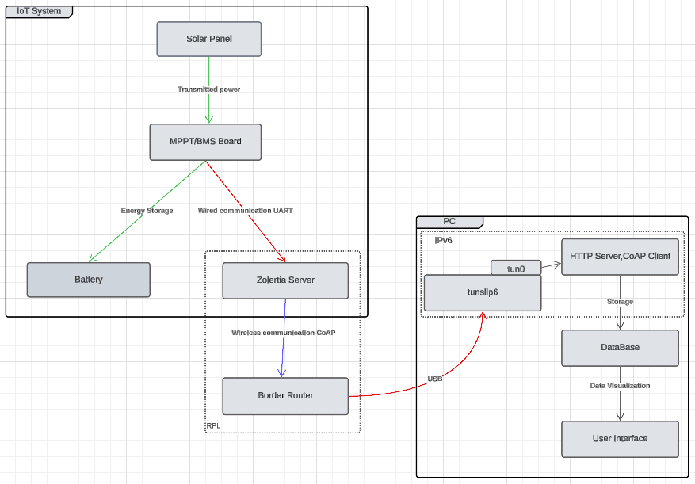

# IoT Project

## **Project Description**

This project aims to design an IoT system capable of collecting, transmitting, and visualizing data using the **CoAP**, **6LoWPAN**, and **IPv6** protocols. The system relies on Zolertia boards powered by solar panels, an energy management system (**MPPT**), and batteries managed by a (**BMS**).

---

## **Objectives**

1. **Solar Energy Management**:
   - Optimize energy production and usage using **MPPT** and **BMS** modules.
   - Store energy in a rechargeable battery to ensure autonomy for the Zolertia Server.

2. **IoT Communication**:
   - Implement **CoAP** (for lightweight communication between Zolertia boards), **6LoWPAN** (for IPv6 adaptation to low-power networks), and **IPv6** (for global connectivity).

3. **Data Visualization and Processing**:
   - Transmit data collected by the Zolertia Border Router to a computer for storage and visualization via a user interface.

---

## **System Architecture**

### **1. Hardware Components**
- **Solar Panel**: Provides energy to power the entire system.
- **MPPT/BMS Board**
   - **MPPT (Maximum Power Point Tracker)**: Optimizes the captured solar energy.
   - **BMS (Battery Management System)**: Manages battery charging and protection.
- **Battery**: Stores energy.
- **Zolertia Boards**: Received data, perform wireless communication (**6LoWPAN**, **IPv6**), and transmit data using the **CoAP** protocol.

### **2. Network Communication**
- **CoAP Protocol**: Ensures efficient and lightweight communication between Zolertia boards.
- **6LoWPAN**: Adapts IPv6 for low-power sensor networks.
- **IPv6**: Provides global connectivity for Zolertia boards.

### **3. Computer**
- GET and stores data from the Zolertia boards.
- Provides a user interface to visualize the collected data.

### **4. Architecture**

---

## **Specifications of the Boards**

### **1. MPPT Board**
- **Role**:
  - Converts and regulates energy from the solar panel to maximize available power.
  - Provides stable power to the **BMS** and the Zolertia Server.
- **Main Features**:
  - Maximum power point tracking (MPPT).
- **Input**: Voltage from the solar panel.
- **Output**: Regulated voltage to the **BMS**.
- **Where we are now**:
  - Siaka 

Current Path: We have understood that the current path is as follows: Check on KiCad, but in general for the MPPT. The signal goes from the panel to the sensor and the battery also goes to the sensor. Then the information passes to the microprocessor. The microprocessor sends the information to the StepDown, which directs the current from the panel to the battery with the good voltage.

The script "pwmSTM32.c" in the folder "electronique": can later be integrated for the MPPT. The goal of the PWM is to use the high and low pins of our board to create a PWM signal. This PWM signal is used to adapt the voltage provided by the solar panel and transmit it to our battery. The duty cycle represents the duration during which our signal is high compared to the entire period. It is this signal that allows us to adjust the voltage coming from the solar panel.

This script is an example of code extracted from the documentation of the STM32 Discovery board and started to be adapted for our case. We tried to integrate it into the project provided by Guillaume Le Gall (https://gitlab2.istic.univ-rennes1.fr/gulegall/esir-miot-base/-/tree/main?ref_type=heads), but we encountered compilation errors that we didn't have time to fix.

### **2. BMS Board**
- **Role**:
  - Monitors, protects, and balances battery cells.
  - Communicates with the Zolertia Server to transmit data.
- **Main Features**:
  - Protection against overcharging, over-discharging, and overcurrent.
  - Balances battery cell charge levels.
- **Input**: Regulated voltage from the MPPT.
- **Output**: Power for the Zolertia Server.
- **Where we are now**:

The script "bms.c" in the folder "electronique": We need to try testing it within the project provided by Guillaume Le Gall (https://gitlab2.istic.univ-rennes1.fr/gulegall/esir-miot-base/-/tree/main?ref_type=heads). We have implemented the "Coulomb Counting" method. This method works by measuring the current flowing in and out of the battery to estimate the State of Charge (SOC). By integrating the current over a given period, it is possible to calculate the remaining charge in the battery. This allows for more precise and efficient battery energy management. We can take 4.2 V as the starting point, which corresponds to a 100% state of charge.

### **3. Soldering Issues and Debugging the Board**
**Debugging the Electronic Board**
During the soldering phase, we encountered unexpected problems with the electronic board. After soldering all the components (see Figure 2: Soldered Board), we observed a voltage of 5.3 V instead of the expected 12 V. Extensive testing revealed that the resistance of R12 had changed from 0.4 Ohms to 500 Ohms. Despite replacing it, the voltage remained incorrect, and R12 continued to deteriorate, indicating a short circuit in the board. We tested the polarization of capacitors and diodes, as well as the transistors and resistors, but a lack of time prevented us from checking the entire circuit. The next step is to isolate and test the 12-volt circuit to identify and fix the problem.

**First Soldering Not Easy**
The first attempt at soldering the components was challenging due to our lack of experience. Some connections were unreliable, causing malfunctions and connectivity issues. Additionally, we sometimes left our soldering iron on the components or the board for too long, damaging some of them. We had to redo several solder joints to improve the connections, which extended the development process.


### **4. Zolertia Server Board**
- **Role**:
  - The Zolertia Server is responsible for collecting voltage and current data from the battery. The Zolertia Server communicates the data to the Zolertia Border Router via the **CoAP** protocol over the **6LoWPAN** wireless network.
- **Main Features**:
   - Received voltage, current and time data from the battery.
   - Provides a wireless interface for communication, compatible with **6LoWPAN**.
   - Ensures lightweight and efficient data exchange using the **CoAP** protocol.


### **5. Border Router Board**
- **Role**:
  - The Border router, powered via USB from a computer, retrieves voltage, current data collected by the Zolertia Server. It communicates with the Zolertia Server using the **CoAP** protocol over the **6LoWPAN** wireless interface to request and gather this information.
- **Main Features**:
   - Communicates wirelessly with the Zolertia Server.
   - Efficiently retrieves voltage, current data using the lightweight **CoAP** protocol.
   - Transmits the retrieved data to the connected computer for further processing and visualization.

---

## **Protocols Used**

1. **CoAP (Constrained Application Protocol)**:
   - Lightweight protocol for IoT devices.
   - Operates over UDP to minimize network overhead.
   - Allows basic client-server interactions (GET, POST, PUT, DELETE).

2. **6LoWPAN (IPv6 over Low Power Wireless Personal Area Networks)**:
   - Compresses IPv6 headers to make them compatible with IoT networks.
   - Suitable for low-power environments and limited bandwidth.

3. **IPv6**:
   - Provides global connectivity and a unique address for each Zolertia boards.

---

## **Transmitted Information**
   - The client Coap server will perform a **GET** request to the Zolertia Server to retrieve data such as voltage, current in a **text** format.
   - The client Coap server will then send this information to the **Database**

UART
```json
text format example: 
voltage : 3.65; current : 1.0
```

CoAP
```json
text format example: 
voltage : 3.65; current : 1.0
```

PC
```json
text format example: 
voltage : 3.65; current : 1.0
```

---

## PC System Overview
- **Role**:
The PC serves as a central hub for data processing, storage, and visualization. It connects to the **Zolertia Border Router** via USB to collect voltage and current data measured by the Zolertia Server.


### 1. Data Storage
- The collected data, including **voltage**, **current**, is stored in a **database** with **InfluxDB**.
- InfluxDB is designed for time-series data, so it automatically timestamps each entry, eliminating the need to manually transmit timestamps.
- **Database Choice (InfluxDB)**: 

| Field      | Type                | Description          |
|:----------:|:-------------------:|:--------------------:|
| Voltage    | FLOAT               | Measured voltage     |
| Intensity  | FLOAT               | Measured current     |


### 2. Data Visualisation
- For real-time visualization and analysis of the collected data, **Grafana** is used.
- **Grafana Integration**:
   - Grafana connects to the InfluxDB database to query and display the data.
   - It provides dashboards to visualize power trends over time.

---

# How to Launch

## Install Required Software

1. **Download and Install InfluxDB & Grafana**  
   - Ensure InfluxDB and Grafana are installed on your system.  
   - Verify that the servers are running by checking their status.  
   - Access InfluxDB via [localhost:8086](http://localhost:8086) and Grafana via [localhost:3000](http://localhost:3000).  

2. **Install Contiki-NG**  
   - Clone the Contiki-NG repository from GitHub:  
     ```bash
     git clone https://github.com/contiki-ng/contiki-ng.git
     cd contiki-ng
     ```
   - Launch the Cooja simulator, which is located in `tools/cooja`:  
     ```bash
     ./gradlew run
     ```
   - The Cooja simulator interface will open, allowing you to import a simulation.  
   - Our simulation file (`cooja.csc`) can be found in the `transmission_data` directory.  

## Configure the IPv6 Tunnel  

To connect the Zolertia border router to your PC, open a terminal and navigate to the `tools/serial-io` directory, always in contiki-ng:  
```bash
cd tools/serial-io
sudo ./tunslip6 -v2 -t tun0 -a localhost -p 60001 1::a/64
```

This command will display the IPv6 address of the Zolertia border router.

## Run the Data Transmission Script

Execute the cooja.py script, providing the IPv6 address of the target Zolertia server:
```python
exemple : python3 cooja.py 1::202:2:2:2
```
This script will retrieve voltage and current values and push them to the InfluxDB database. You can then visualize the data in the dashboarb "power" using Grafana.

---

## **Contributors**
- Thibault Guérinel, Siaka Traoré, Tristan Gallais
- ESIR-IOT
